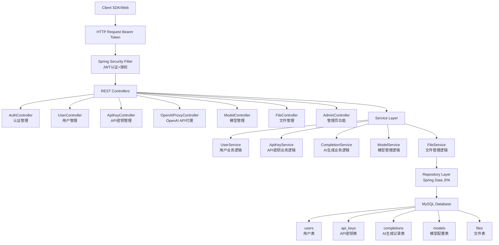
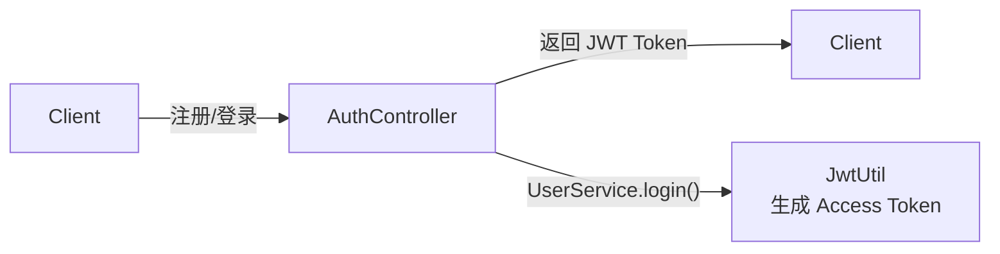
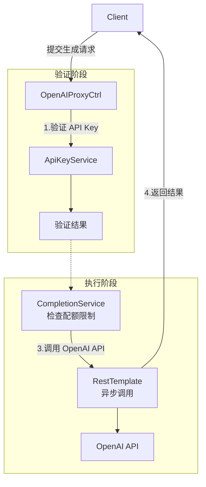
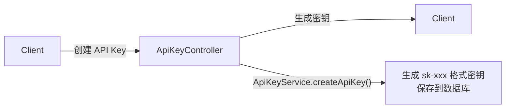

## GDUF第三轮后端考核说明(智能应用方向)

## 项目说明

本项目是GDUF第三轮考核项目，相比于第二轮考核，

### 核心功能

- **用户认证系统**：支持用户注册、登录、JWT 令牌认证
- **API Key 管理**：支持创建、更新、删除 API Key，支持启用/禁用控制
- **配额与限流**：支持按 API Key 设置速率限制和每日配额限制
- **异步请求处理**：使用 DeferredResult 实现异步非阻塞请求处理
- **OpenAI API 代理**：兼容 OpenAI API 接口规范，代理聊天完成、文本完成等接口
- **权限控制**：基于 Spring Security + JWT 的 RBAC 权限控制
- **API 文档**：集成 SpringDoc OpenAPI 3，提供可视化接口文档
  
  ### 技术栈
- **后端框架**：Spring Boot 3.2.5
- **编程语言**：Java 17
- **数据库**：MySQL 8.0+
- **ORM 框架**：Spring Data JPA
- **安全认证**：Spring Security + JWT
- **API 文档**：SpringDoc OpenAPI (Swagger UI)
- **构建工具**：Maven
- **其他**：Lombok, Hibernate Validator


# 项目架构

## 系统架构图


## 鉴权与生成流程说明
- **JWT 认证流程**


- **AI 生成请求流程**
  

- **API Key 生成流程**

**数据库配置**

CREATE DATABASE openai CHARACTER SET utf8mb4 COLLATE utf8mb4_unicode_ci;
详细建表语句见  openai.text

修改 `src/main/resources/application.properties` 中的数据库配置：

properties spring.datasource.url=jdbc:mysql://localhost:3306/openai?useSSL=false&serverTimezone=Asia/Shanghai&allowPublicKeyRetrieval=true&characterEncoding=utf8 spring.datasource.username=your_username spring.datasource.password=your_password

修改 OpenAI API 配置：
properties openai.api.url=your_openai_api_url 
openai.api.key=your_openai_api_key


## SDK 测试说明

### 1. 用户注册和登录

#### 注册用户

```bash
curl -X POST http://localhost:8081/api/auth/register \
  -H "Content-Type: application/json" \
  -d '{
    "username": "testuser",
    "email": "test@example.com",
    "password": "password123"
  }'


```
**响应示例**：
```json

{
  "success": true,
  "message": "注册成功",
  "data": {
    "token": "eyJhbGciOiJIUzUxMiJ9...",
    "refreshToken": "eyJhbGciOiJIUzUxMiJ9...",
    "tokenType": "Bearer",
    "expiresIn": 86400000
  }
}

```
#### 用户登录
```bash
bash curl -X POST http://localhost:8081/api/auth/login
-H "Content-Type: application/json"
-d '{ "identifier":
"testuser",
"password":
"password123"
}'

```
**响应示例**：
```json
{ "success": true, 
"message": "注册成功", 
"data": 
{ "token": "eyJhbGciOiJIUzUxMiJ9...", 
"refreshToken": "eyJhbGciOiJIUzUxMiJ9...", 
"tokenType": "Bearer",
"expiresIn": 86400000 
} 
}

```


### 2. API Key 管理

#### 创建 API Key
```bash
curl -X POST http://localhost:8081/api/api-keys
-H "Content-Type: application/json"
-H "Authorization: Bearer YOUR_JWT_TOKEN"
-d '{ "name":
"测试密钥",
"rateLimit": 100,
 "dailyLimit": 1000,
 "expiresAt": "2025-12-31T23:59:59"
}'
```
**响应示例**：

```json
{ "success":
 true, "message":
 "操作成功",
"data":
{ "id": 1,
"apiKey":
 "sk-a1b2c3d4e5f6...",
 "maskedApiKey": "sk-***...f6g7",
"name": "测试密钥",
"isActive": true,
 "rateLimit": 100,
 "dailyLimit": 1000,
 "usedCount": 0,
"createdAt": "2025-05-06T10:30:00"
 }
}
```

#### 查看用户的所有 API Key
```bash
curl -X GET http://localhost:8081/api/api-keys 
-H "Authorization: Bearer YOUR_JWT_TOKEN"
```
#### 更新 API Key
```
bash curl -X PUT http://localhost:8081/api/api-keys/1
-H "Content-Type: application/json"
-H "Authorization: Bearer YOUR_JWT_TOKEN"
-d '{ "name": "更新后的密钥名称",
 "dailyLimit": 2000
}'

```

#### 禁用/启用 API Key

```bash
禁用
curl -X PATCH http://localhost:8081/api/api-keys/1/disable
-H "Authorization: Bearer YOUR_JWT_TOKEN"
启用
curl -X PATCH http://localhost:8081/api/api-keys/1/enable
-H "Authorization: Bearer YOUR_JWT_TOKEN"
```
#### 删除 API Key
```bash
curl -X DELETE http://localhost:8081/api/api-keys/1
-H "Authorization: Bearer YOUR_JWT_TOKEN"

```

### 3. OpenAI API 代理测试

#### 聊天完成（Chat Completions）

```bash curl -X POST http://localhost:8081/v1/chat/completions
-H "Content-Type: application/json"
-H "Authorization: Bearer YOUR_API_KEY"
-d '{ "model": "gpt-3.5-turbo",
"messages": [ { "role": "system",
"content": "你是一个 helpful assistant."},
{"role": "user", "content": "请介绍一下 Java 17 的新特性"} ],
 "temperature": 0.7, "max_tokens": 1000
}'

```
**响应示例**：
```json
 { "success": true,
 "message": "操作成功",
 "data": { "id": "chatcmpl-abc123",
 "object": "chat.completion",
 "created": 1680000000,
"model": "gpt-3.5-turbo",
 "choices": [ { "index": 0, "message": { "role": "assistant",
 "content": "Java 17 引入了以下新特性：\n1. 密封类（Sealed Classes）\n2. 模式匹配增强\n3. 新的 GC 算法\n..." },
"finish_reason": "stop" } ],
"usage": { "prompt_tokens": 50,
 "completion_tokens": 200,
 "total_tokens": 250
}
}
}

```

#### 获取模型列表
```bash curl -X GET http://localhost:8081/v1/models
-H "Authorization: Bearer YOUR_API_KEY"
```
#### 查询生成历史
```bash curl -X GET http://localhost:8081/v1/chat/completions/COMPLETION_ID
-H "Authorization: Bearer YOUR_API_KEY"
```

## AIGC 使用说明

本项目在开发过程中引入了人工智能生成内容技术，用于辅助代码编写、文档生成及资源制作，基本的代码风格增删改查等，结构框架等由自己设计，并让千问帮我写重复功能的体力活。\
使用范围\
代码辅助：部分通用逻辑代码（如工具类函数、正则表达式、数据库连接配置）由 AI 生成，并经人工审查与测试。\
文档编写：部分说明文档（如 README 结构、代码注释、API 文档模板）参考了 AI 生成的文本。\
数据/测试：部分测试数据（如 JSON 模拟数据、用户测试用例）由 AI 生成。\
代码bug修复：由ai查找并提供修改方案，经人工审查采用最优解。

